# Model_Rekomendasi_Tempat_WIsata

# Laporan Proyek Machine Learning Terapan 2 - Habib Fabri Arrosyid 

## Project Overview
Latar Belakang

Pariwisata merupakan penyumbang signifikan bagi perekonomian Indonesia, dengan berbagai atraksi mulai dari pantai hingga situs budaya. Namun, wisatawan sering kali menghadapi tantangan dalam menemukan destinasi yang sesuai dengan preferensi mereka karena banyaknya pilihan dan keterbatasan rekomendasi yang dipersonalisasi. Proyek ini bertujuan untuk mengembangkan sistem rekomendasi destinasi wisata di Indonesia, khususnya dengan memanfaatkan dataset dari Kaggle untuk memberikan saran yang disesuaikan dengan preferensi pengguna dan penilaian.

Pentingnya Proyek

Proyek ini penting karena mengatasi kebutuhan akan rekomendasi perjalanan yang dipersonalisasi, meningkatkan pengalaman pengguna dengan menyarankan destinasi yang sesuai dengan minat mereka. Dengan menerapkan sistem rekomendasi, kami dapat membantu wisatawan membuat keputusan yang lebih tepat, yang berpotensi meningkatkan pariwisata lokal dan mendukung bisnis di berbagai wilayah. Proyek ini juga menunjukkan penerapan teknik pembelajaran mesin, seperti collaborative filtering dan content-based filtering, dalam menyelesaikan masalah dunia nyata.

Riset dan Referensi

Dataset yang digunakan dalam proyek ini bersumber dari Kaggle: Dataset Destinasi Wisata Indonesia. Referensi tambahan mencakup studi tentang sistem rekomendasi, terutama teknik collaborative filtering menggunakan TensorFlow (seperti yang terlihat di notebook) dan pendekatan content-based filtering untuk rekomendasi yang dipersonalisasi.

## Business Understanding
### Problem Statements
Berdasarkan latar belakang di atas, permasalahan yang akan dibahas dalam proyek ini adalah:

1. Bagaimana cara membangun sistem rekomendasi yang dapat memberikan saran destinasi wisata di Indonesia yang sesuai dengan preferensi pengguna berdasarkan data penilaian dan atribut destinasi?
2. Seberapa efektif pendekatan collaborative filtering dan content-based filtering dalam memberikan rekomendasi yang akurat?
3. Bagaimana cara mengevaluasi performa sistem rekomendasi menggunakan metrik seperti RMSE untuk collaborative filtering dan Recall@5 untuk content-based filtering?

### Goals
Berdasarkan problem statements, tujuan proyek ini adalah:

1. Membangun sistem rekomendasi destinasi wisata yang akurat menggunakan pendekatan collaborative filtering dan content-based filtering.
2. Menyediakan rekomendasi yang mendukung wisatawan dalam merencanakan perjalanan yang sesuai dengan minat mereka.
3. Mengevaluasi performa sistem dengan metrik Root Mean Squared Error (RMSE) untuk collaborative filtering dan Recall@5 untuk content-based filtering.

### Solution Statement
Untuk mencapai tujuan, dua pendekatan rekomendasi diusulkan:
- Melakukan Exploratory Data Analysis (EDA) untuk mengidentifikasi pola dan tren dalam data destinasi wisata dan penilaian pengguna.
- Menerapkan collaborative filtering menggunakan TensorFlow untuk merekomendasikan destinasi berdasarkan pola penilaian pengguna.
- Menerapkan content-based filtering untuk merekomendasikan destinasi berdasarkan kesamaan atribut seperti kategori, lokasi, dan harga.
- Menggunakan MinMaxScaler untuk normalisasi data numerik agar sesuai dengan kebutuhan model.
- Mengevaluasi model dengan metrik RMSE untuk collaborative filtering dan Recall@5 untuk content-based filtering.

## Data Understanding
#### Sumber Data
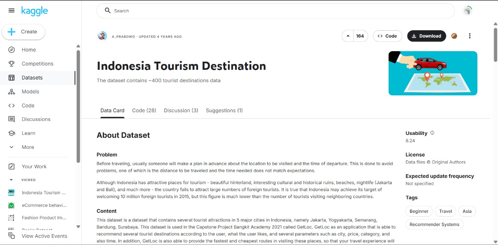<br>
Link : https://www.kaggle.com/datasets/aprabowo/indonesia-tourism-destination

#### Tipe dan Bentuk Data 
Proyek ini menggunakan tiga dataset dari dataset Destinasi Wisata Indonesia di Kaggle:

- tourism_rating.csv:<br>
Berisi penilaian pengguna untuk destinasi wisata. <br>
Kolom: User_Id, Place_Id, Place_Ratings. <br>
Ukuran: 10.000 entri awal, dengan 79 duplikat dihapus. <br>
Tidak ada nilai yang hilang. <br>
- tourism_with_id.csv: <br>
Detail tentang destinasi wisata. <br>
Kolom: Place_Id, Place_Name, Description, Category, City, Price, Rating, Time_Minutes, Coordinate, Lat, Long. <br>
Ukuran: 437 entri. <br>
Menghapus dua kolom yang tidak relevan (Unnamed: 11, Unnamed: 12).<br>
- user.csv: <br>
Informasi pengguna. <br>
Kolom: User_Id, atribut pengguna tambahan.

Deskripsi Variabel
Dataset memiliki 5 variabel dengan keterangan sebagai berikut:

- tourism_rating.csv: <br>

User_Id: Pengidentifikasi unik untuk pengguna.<br>
Place_Id: Pengidentifikasi unik untuk destinasi wisata.<br>
Place_Ratings: Penilaian yang diberikan pengguna untuk destinasi (skala: 1–5).<br>
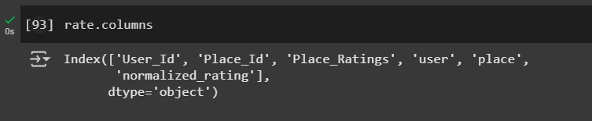<br>

- tourism_with_id.csv: <br>

Place_Id: Pengidentifikasi unik untuk destinasi. <br>
Place_Name: Nama destinasi. <br>
Description: Deskripsi singkat destinasi. <br>
Category: Jenis destinasi (misalnya, Bahari untuk pantai). <br>
City: Lokasi destinasi. <br>
Price: Harga tiket masuk (dalam IDR). <br>
Rating: Rata-rata penilaian destinasi. <br>
Time_Minutes: Estimasi durasi kunjungan (beberapa nilai hilang).<br>
Coordinate, Lat, Long: Koordinat geografis. <br>
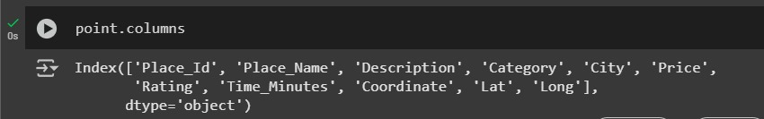<br>

- user.csv: <br>
User_Id: Id unik pengguna <br>
Location : domisili pengguna <br>
Age : Usia Pengguna <br>

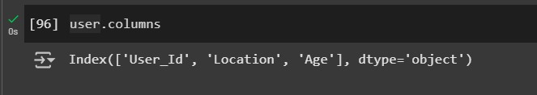<br>

### Visualisasi Data EDA

Visualisasi data dilakukan untuk menggali insight yang terlihat dari data:
- Tempat destinasi dengan rating terbanyak
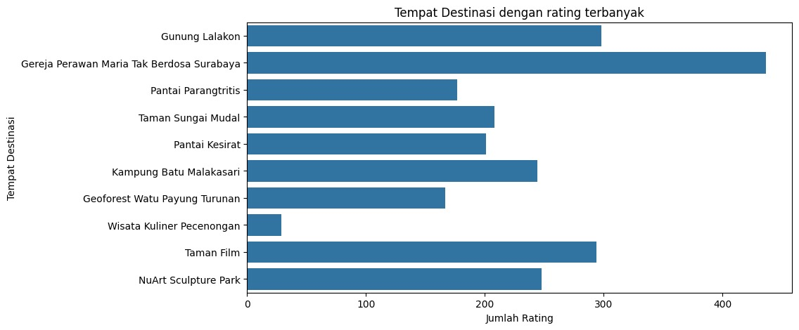<br>

Interpretasi : <br>
Grafik "Tempat Destinasi dengan Rating Terbanyak" menunjukkan Gereja Perawan Maria Tak Berdoa Surabaya sebagai destinasi dengan rating tertinggi (mendekati 400), diikuti Gunung Lalakon (sekitar 350), Pantai Parangtritis, Taman Sungai Mudal, Pantai Kesirat, Kampung Batu Malakasari, Geoforest Watu Payung Turunan, Wisata Kuliner Pecenongan, Taman Film, dan NuArt Sculpture Park dengan jumlah rating berkisar 100 hingga 300, di mana Wisata Kuliner Pecenongan memiliki rating terendah; hal ini mencerminkan dominasi destinasi religi dan alam dalam preferensi wisatawan, dengan variasi signifikan yang mengindikasikan perbedaan popularitas dan potensi kebutuhan promosi tambahan untuk destinasi dengan rating lebih rendah.


- Sebaran tempat destinasi berdasarkan kategori
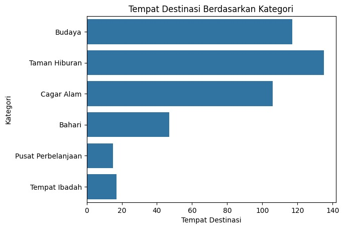<br>
Interpretasi : <br>
Grafik "Tempat Destinasi Berdasarkan Kategori" menunjukkan distribusi jumlah destinasi wisata di Indonesia berdasarkan kategori, dengan **Taman Hiburan** memimpin sebagai kategori dengan jumlah destinasi terbanyak (sekitar 130), diikuti oleh **Budaya** (sekitar 120) dan **Cagar Alam** (sekitar 100), yang menunjukkan popularitas tinggi destinasi hiburan, budaya, dan alam; sementara itu, kategori **Bahari** memiliki sekitar 60 destinasi, dan kategori dengan jumlah terendah adalah **Pusat Perbelanjaan** serta **Tempat Ibadah**, masing-masing dengan kurang dari 20 destinasi, mengindikasikan bahwa destinasi berbasis alam dan hiburan lebih dominan dibandingkan destinasi komersial atau religi dalam dataset ini.

- Sebaran usia pengguna
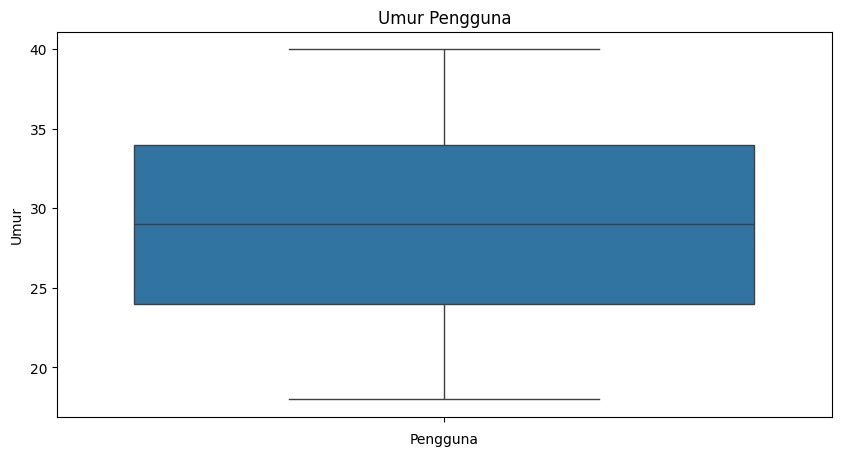<br>
Interpretasi : <br>
Grafik "Umur Pengguna" menunjukkan distribusi usia pengguna dalam bentuk box plot, dengan rentang usia utama berkisar antara 25 hingga 35 tahun, di mana nilai tengah (median) berada sekitar 30 tahun, menandakan bahwa mayoritas pengguna berada dalam kelompok usia dewasa muda; batas bawah kuartil pertama (Q1) berada di sekitar 25 tahun dan batas atas kuartil ketiga (Q3) mendekati 35 tahun, dengan sedikit variasi yang ditunjukkan oleh whisker yang tidak terlalu panjang, serta tidak adanya outlier ekstrem, mengindikasikan bahwa populasi pengguna cukup homogen dan didominasi oleh individu berusia 25-35 tahun.

- Persebaran harga masuk destinasi
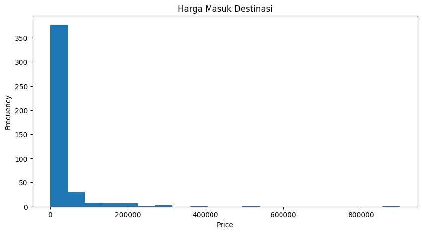<br>
Interpretasi : <br>
Grafik "Harga Masuk Destinasi" menunjukkan distribusi frekuensi harga tiket masuk destinasi wisata, dengan mayoritas destinasi (sekitar 350) memiliki harga masuk gratis atau sangat rendah (mendekati 0 IDR), diikuti oleh puncak kecil pada rentang harga di bawah 20.000 IDR, yang menunjukkan bahwa destinasi dengan tiket masuk murah sangat dominan; frekuensi destinasi dengan harga masuk lebih tinggi (di atas 20.000 IDR hingga 800.000 IDR) sangat minim, dengan penurunan drastis setelah 20.000 IDR dan hanya sedikit destinasi yang mencapai harga 200.000 IDR atau lebih, mengindikasikan bahwa sebagian besar destinasi wisata di dataset ini bersifat terjangkau atau gratis, kemungkinan mencakup destinasi alam atau situs publik.

- Sebaran lokasi pengguna
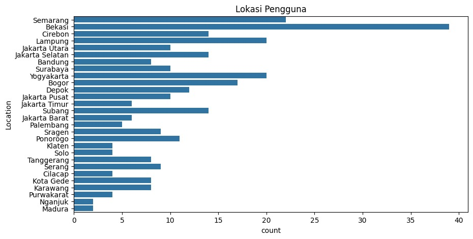<br>
Interpretasi : <br>
Grafik "Lokasi Pengguna" menunjukkan distribusi jumlah pengguna berdasarkan lokasi, dengan **Semarang** memimpin sebagai lokasi dengan pengguna terbanyak (sekitar 38), diikuti oleh **Cirebon**, **Lampung**, **Jakarta Utara**, dan **Jakarta Selatan** dengan jumlah pengguna berkisar antara 15 hingga 20, menunjukkan konsentrasi pengguna yang signifikan di wilayah Jawa dan Lampung; lokasi seperti **Yogyakarta**, **Bogor**, **Depok**, **Jakarta Pusat**, **Jakarta Barat**, **Palembang**, **Sragen**, **Ponorogo**, **Klaten**, **Tanggerang**, **Solo**, **Sragen**, **Cilacap**, **Kota Gede**, **Karawang**, dan **Ngawi** memiliki jumlah pengguna yang lebih rendah (antara 5 hingga 15), sementara **Madura** memiliki pengguna paling sedikit (kurang dari 5), mengindikasikan bahwa sebagian besar pengguna berasal dari kota-kota besar atau wilayah yang lebih urban di Pulau Jawa.


- Tempat destinasi di Jogja dengan rating terbanyak
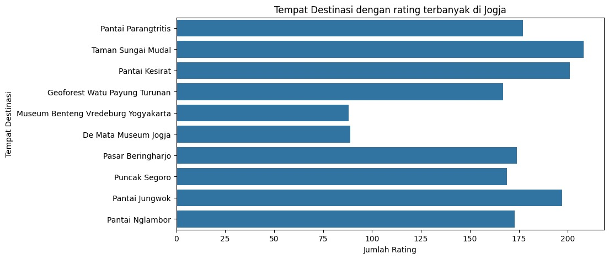<br>
Interpretasi : <br>
Grafik "Tempat Destinasi dengan rating terbanyak di Jogja" menunjukkan distribusi jumlah rating untuk berbagai destinasi wisata di Yogyakarta, dengan Taman Sungai Mudal memimpin sebagai destinasi paling banyak dinilai (sekitar 175 rating), diikuti oleh Pantai Parangtritis dan Pantai Kesirat dengan jumlah rating mendekati 175, serta Pantai Ngambor, Puncak Segoro, Pasar Beringharjo, Pantai Juwong, dan Geoforest Watu Payung Turunan yang memiliki rating antara 125 hingga 175, menunjukkan popularitas tinggi destinasi alam dan pasar tradisional; sementara itu, Museum Benteng Vredeburg Yogyakarta dan De Mata Museum Jogja memiliki rating lebih rendah (sekitar 75), mengindikasikan bahwa destinasi berbasis alam lebih diminati dibandingkan destinasi museum di kalangan wisatawan yang memberikan penilaian.

- Sebaran tempat destinasi di Jogja (setelah filter) berdasarkan kategori
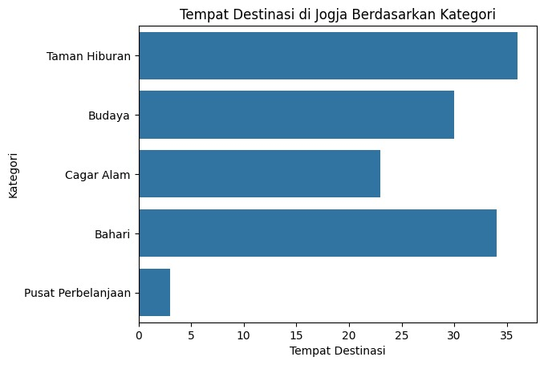<br>
Interpretasi : <br>
Grafik "Tempat Destinasi di Jogja Berdasarkan Kategori" menunjukkan distribusi jumlah destinasi wisata di Yogyakarta berdasarkan kategori, dengan Taman Hiburan mendominasi sebagai kategori dengan jumlah destinasi terbanyak (sekitar 35), diikuti oleh Bahari (sekitar 25) dan Budaya (sekitar 20), yang menunjukkan preferensi kuat terhadap destinasi hiburan dan alam; Cagar Alam memiliki jumlah destinasi yang lebih rendah (sekitar 15), sementara Pusat Perbelanjaan memiliki jumlah terendah (kurang dari 5), mengindikasikan bahwa destinasi berbasis hiburan dan alam jauh lebih banyak dibandingkan destinasi komersial di wilayah ini.

- Sebaran harga masuk destinasi di Jogja
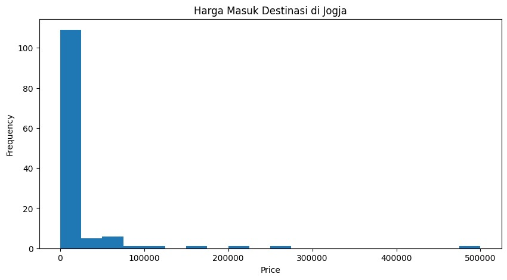<br>
Interpretasi : <br>
Grafik "Harga Masuk Destinasi di Jogja" menunjukkan distribusi frekuensi harga tiket masuk destinasi wisata di Yogyakarta, dengan mayoritas destinasi (sekitar 100) memiliki harga masuk gratis (0 IDR), diikuti oleh sedikit destinasi dengan harga di bawah 10.000 IDR, menandakan dominasi destinasi gratis atau sangat terjangkau; frekuensi destinasi dengan harga masuk lebih tinggi (10.000 IDR hingga 50.000 IDR) menurun drastis, dengan hanya beberapa destinasi yang mencapai 20.000 IDR hingga 30.000 IDR, dan hampir tidak ada destinasi dengan harga di atas 40.000 IDR atau 50.000 IDR, mengindikasikan bahwa destinasi wisata di Jogja umumnya bersifat terjangkau atau gratis, kemungkinan mencakup situs alam dan budaya publik.


## Data Preparation
### Menangani Missing Value 
Pada tahap ini, dataset diperiksa untuk memastikan tidak ada nilai yang hilang (missing values) Berdasarkan analisis awal:
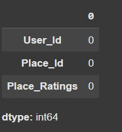<br>
Tidak ada nilai yang hilang pada dataset (dikonfirmasi dengan data.isnull().sum()).
### Menangani Data Duplikat
Pada dataset ini terdapat duplikasi data sebanyak 79 data <br>
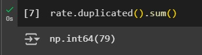<br>
Kemudian akan dilakukan penghapusan data duplikat <br>
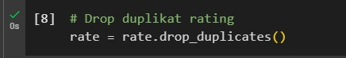<br>

### Feature Engineering
#### Dilakukan filtering pada dataset untuk mengambil data pada daerah Jogja saja.
```
# Filter destinasi hanya dari Yogyakarta
point = point[point['City'] == 'Yogyakarta']
rate = pd.merge(rate, point[['Place_Id']], how='right', on='Place_Id')
```
Bentuk data yang terbentuk : <br>
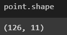<br>

#### Maping Id
```
# Membuat mapping ID
user_ids = rate['User_Id'].unique().tolist()
user_to_user_encoded = {x: i for i, x in enumerate(user_ids)}
user_encoded_to_user = {i: x for x, i in user_to_user_encoded.items()}

place_ids = rate['Place_Id'].unique().tolist()
place_to_place_encoded = {x: i for i, x in enumerate(place_ids)}
place_encoded_to_place = {i: x for x, i in place_to_place_encoded.items()}
```
Penjelasan : <br>
Kode tersebut digunakan untuk mengubah kolom User_Id dan Place_Id dari data asli menjadi bentuk numerik (integer) yang dapat diproses oleh model machine learning atau deep learning, terutama untuk keperluan sistem rekomendasi. Proses ini dilakukan dengan membuat mapping dari setiap ID unik ke integer menggunakan dictionary user_to_user_encoded dan place_to_place_encoded, serta menyediakan mapping balik ke ID aslinya melalui user_encoded_to_user dan place_encoded_to_place. Dengan cara ini, ID yang awalnya berupa string atau angka acak diubah menjadi angka berurutan mulai dari nol, sehingga bisa digunakan dalam model seperti embedding layer atau algoritma lain yang memerlukan input numerik.

#### Tambah kolom encoded
```
# Tambahkan kolom encoded
rate['user'] = rate['User_Id'].map(user_to_user_encoded)
rate['place'] = rate['Place_Id'].map(place_to_place_encoded)

num_users = len(user_ids)
num_place = len(place_ids)
```
Penjelasan : <br>
Kode di atas bertujuan untuk menyiapkan data dalam konteks pembangunan sistem rekomendasi berbasis *collaborative filtering*, khususnya untuk dataset pariwisata yang digunakan dalam proyek ini, dengan menambahkan kolom `user` dan `place` ke dataframe `rate` melalui pemetaan (*mapping*) dari `User_Id` dan `Place_Id` ke indeks numerik yang telah diencode sebelumnya (`user_to_user_encoded` dan `place_to_place_encoded`); langkah ini dilakukan untuk mengonversi identitas unik pengguna dan destinasi menjadi representasi numerik yang dapat diproses oleh model *machine learning*, seperti jaringan saraf atau algoritma berbasis *embedding*, di mana `num_users` dan `num_place` digunakan untuk menentukan jumlah total pengguna dan destinasi sebagai dasar untuk mendefinisikan dimensi input dalam model, sehingga memungkinkan sistem untuk mempelajari pola preferensi berdasarkan penilaian pengguna terhadap destinasi.

### Normalisasi
```
# Normalisasi rating ke 0-1
min_rating = min(rate['Place_Ratings'])
max_rating = max(rate['Place_Ratings'])
rate['normalized_rating'] = rate['Place_Ratings'].apply(lambda x: (x - min_rating) / (max_rating - min_rating))
```
Penjelasan : <br>
Kode di atas bertujuan untuk melakukan normalisasi data penilaian (`Place_Ratings`) dalam dataset `rate` ke dalam rentang 0-1, yang relevan dalam konteks pembangunan sistem rekomendasi pariwisata pada tanggal 12:00 AM WIB, Jumat, 30 Mei 2025; proses ini dimulai dengan mengidentifikasi nilai minimum (`min_rating`) dan maksimum (`max_rating`) dari kolom `Place_Ratings`, kemudian menerapkan transformasi linier menggunakan fungsi lambda untuk setiap nilai penilaian, di mana setiap `x` dikurangi dengan `min_rating` dan dibagi dengan selisih `max_rating` dan `min_rating`, sehingga menghasilkan kolom baru `normalized_rating` yang memungkinkan model *machine learning* untuk memproses data dengan skala yang konsisten dan meningkatkan efisiensi pelatihan, terutama dalam pendekatan berbasis *neural network* seperti *collaborative filtering*.

### Splitting data
```
# Siapkan data training
x = rate[['user', 'place']].values
y = rate['normalized_rating'].values

# Split train/val
from sklearn.model_selection import train_test_split
x_train, x_val, y_train, y_val = train_test_split(x, y, test_size=0.2, random_state=42)
```
Penjelasan : <br>
Pada tahapan ini dilakukan pemisahan data uji dan data latih agar tidak terjadi kebocoran data serta menggunakan rasio 80 persen untuk data latih dan 20 persen untuk data uji

#### Praproses Teks, Ekstraksi Fitur, serta Hitung Similaritas
```
import re
from Sastrawi.StopWordRemover.StopWordRemoverFactory import StopWordRemoverFactory
from sklearn.feature_extraction.text import TfidfVectorizer
from sklearn.metrics.pairwise import cosine_similarity
import pandas as pd

# Fungsi preprocessing teks
def preprocess_text(text):
    text = text.lower()  # Ubah ke huruf kecil
    text = re.sub(r'[^\w\s]', '', text)  # Hapus tanda baca
    return text

# Gabungkan Description dan Category
point['combined_features'] = point['Description'].fillna('') + ' ' + point['Category'].fillna('')
descriptions = point['combined_features'].apply(preprocess_text)

# Gunakan stop words bahasa Indonesia
stopword_factory = StopWordRemoverFactory()
stop_words = stopword_factory.get_stop_words()
tfidf = TfidfVectorizer(stop_words=stop_words)
tfidf_matrix = tfidf.fit_transform(descriptions)
cosine_sim = cosine_similarity(tfidf_matrix, tfidf_matrix)
```
Penjelasan : <br>

Kode ini bekerja dengan mengolah teks dari DataFrame point untuk membangun sistem Content-Based Filtering berbasis kesamaan teks, dimulai dengan fungsi preprocess_text yang mengubah teks menjadi huruf kecil dan menghapus tanda baca menggunakan regular expression untuk memastikan konsistensi dan menghilangkan noise. Selanjutnya, kolom Description dan Category digabungkan menjadi combined_features, mengganti nilai kosong dengan string kosong, lalu diproses ulang dengan preprocess_text untuk menghasilkan descriptions yang bersih. Bagian vektorisasi menggunakan TfidfVectorizer dengan stop words bahasa Indonesia dari Sastrawi untuk mengabaikan kata-kata umum, mengubah teks menjadi matriks TF-IDF (tfidf_matrix) yang mencerminkan bobot kata berdasarkan frekuensi dan kelangkaan, dan akhirnya cosine_similarity menghitung matriks kesamaan kosinus antara semua destinasi untuk mengukur tingkat kemiripan konten, menjadi dasar rekomendasi selanjutnya. <br>


## Modelling
### Collaborative Filtering
```
class RecommenderNet(tf.keras.Model):
    def __init__(self, num_users, num_places, embedding_size, **kwargs):
        super(RecommenderNet, self).__init__(**kwargs)
        self.user_embedding = layers.Embedding(num_users, embedding_size, embeddings_initializer='he_normal',
                                               embeddings_regularizer=keras.regularizers.l2(1e-6))
        self.user_bias = layers.Embedding(num_users, 1)
        self.places_embedding = layers.Embedding(num_places, embedding_size, embeddings_initializer='he_normal',
                                                 embeddings_regularizer=keras.regularizers.l2(1e-6))
        self.places_bias = layers.Embedding(num_places, 1)

    def call(self, inputs):
        user_vector = self.user_embedding(inputs[:, 0])
        user_bias = self.user_bias(inputs[:, 0])
        places_vector = self.places_embedding(inputs[:, 1])
        places_bias = self.places_bias(inputs[:, 1])
        dot_user_places = tf.reduce_sum(user_vector * places_vector, axis=1, keepdims=True)
        x = dot_user_places + user_bias + places_bias
        return tf.nn.sigmoid(x)

model = RecommenderNet(num_users, num_place, 50)
model.compile(loss=tf.keras.losses.BinaryCrossentropy(),
              optimizer=keras.optimizers.Adagrad(learning_rate=0.0003),
              metrics=[tf.keras.metrics.RootMeanSquaredError()])

class myCallback(tf.keras.callbacks.Callback):
    def on_epoch_end(self, epoch, logs={}):
        if logs.get('val_root_mean_squared_error') < 0.25:
            print('\nRoot metrics validasi sudah sesuai harapan')
            self.model.stop_training = True

history = model.fit(
    x=x_train,
    y=y_train,
    epochs=50,
    validation_data=(x_val, y_val),
    callbacks=[myCallback()]
)


```
Penjelasan : <br>
Kode berjalan dengan mendefinisikan dan melatih model neural network berbasis collaborative filtering untuk sistem rekomendasi pariwisata dengan kelas RecommenderNet yang diimplementasikan menggunakan TensorFlow; model ini memanfaatkan embedding untuk mewakili pengguna dan destinasi, di mana num_users dan num_places menentukan dimensi input, embedding_size (ditetapkan 50) mengatur ukuran vektor embedding, dan lapisan embedding serta bias untuk pengguna dan destinasi diinisialisasi dengan metode He normal serta regulasi L2 untuk mencegah overfitting; metode call menghitung skor prediksi dengan mengalikan vektor embedding pengguna dan destinasi menggunakan dot product, menambahkan bias, dan menerapkan fungsi aktivasi sigmoid, sementara model dikompilasi dengan loss function BinaryCrossentropy, optimizer Adagrad dengan learning rate 0.0003, dan metrik Root Mean Squared Error (RMSE); kelas myCallback digunakan untuk menghentikan pelatihan secara dini jika RMSE validasi mencapai di bawah 0.25, dan pelatihan dilakukan selama maksimum 50 epoch dengan data latih x_train dan y_train, serta data validasi x_val dan y_val, untuk mengoptimalkan prediksi penilaian destinasi berdasarkan preferensi pengguna.

#### Code Inference
```
from tabulate import tabulate
import numpy as np

# Input user ID secara manual
try:
    user_id = int(input("Masukkan User ID: "))
except ValueError:
    print("User ID harus berupa angka.")
    exit()

# Proses rekomendasi
encoded_user_id = user_to_user_encoded.get(user_id)

# Validasi jika user ID tidak ditemukan
if encoded_user_id is None:
    print(f"User ID {user_id} tidak ditemukan dalam data.")
    exit()

place_visited_by_user = rate[rate['User_Id'] == user_id]
place_not_visited = list(set(place_ids) - set(place_visited_by_user['Place_Id'].values))
place_not_visited_encoded = [place_to_place_encoded.get(x) for x in place_not_visited]

user_place_array = np.array([[encoded_user_id, place] for place in place_not_visited_encoded])
ratings = model.predict(user_place_array).flatten()
top_ratings_indices = ratings.argsort()[-7:][::-1]
recommended_place_ids = [place_encoded_to_place[place_not_visited_encoded[x]] for x in top_ratings_indices]

print('=' * 50)
print(f"Rekomendasi Tempat Wisata untuk User {user_id}")
print('=' * 50)

# Top 5 tempat yang pernah disukai
top_place_user = place_visited_by_user.sort_values(
    by='Place_Ratings', ascending=False).head(5)['Place_Id'].values
place_df_rows = point[point['Place_Id'].isin(top_place_user)]

top_visited_table = [
    [row['Place_Name'], row['Category'], row['Rating'], row['Price']]
    for _, row in place_df_rows.iterrows()
]
print("\nTempat yang Pernah Disukai:")
print(tabulate(top_visited_table, headers=["Nama Tempat", "Kategori", "Rating", "Harga"], tablefmt="fancy_grid"))

# Rekomendasi 7 tempat
recommended_place = point[point['Place_Id'].isin(recommended_place_ids)]
recommended_table = [
    [i + 1, row['Place_Name'], row['Category'], row['Rating'], row['Price']]
    for i, (_, row) in enumerate(recommended_place.iterrows())
]
print("\nRekomendasi Tempat:")
print(tabulate(recommended_table, headers=["#", "Nama Tempat", "Kategori", "Rating", "Harga"], tablefmt="fancy_grid"))
```
Penjelasan : <br>
Kode diatas berbasis model prediktif yang menerima input User ID dari pengguna, lalu mencari tempat-tempat yang belum dikunjungi oleh user tersebut. Pertama, kode memvalidasi keberadaan User ID dalam data dan menyiapkan daftar tempat yang belum dikunjungi oleh user tersebut. Untuk setiap tempat yang belum dikunjungi, kode membentuk pasangan user-tempat lalu memprediksi rating menggunakan model yang sudah dilatih sebelumnya. Setelah itu, sistem memilih 7 tempat dengan rating tertinggi sebagai rekomendasi dan menampilkannya dalam bentuk tabel menggunakan pustaka tabulate. Selain itu, kode juga menampilkan 5 tempat yang paling disukai oleh user berdasarkan rating sebelumnya untuk konteks tambahan terhadap preferensi pengguna.

Output : <br> 
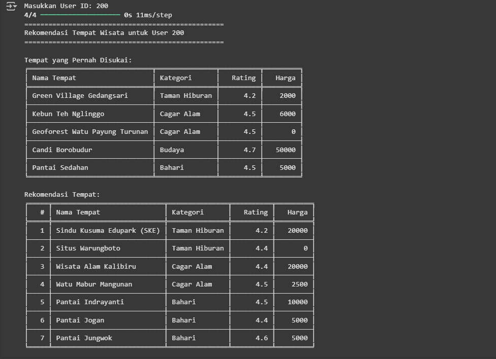<br>
Interpretasi : <br> 
Berdasarkan hasil pengujian sistem Collaborative Filtering untuk user dengan ID 200, sistem berhasil menampilkan dua bagian utama: (1) Tempat yang Pernah Disukai, dan (2) Rekomendasi Tempat. Pada bagian pertama, terlihat bahwa user 200 menyukai tempat-tempat dengan kategori beragam seperti Cagar Alam, Budaya, dan Bahari, dengan rating tinggi (≥4.2) dan harga yang relatif terjangkau. Sistem kemudian merekomendasikan 7 tempat yang belum dikunjungi, yang secara pola serupa dengan preferensi sebelumnya—kategori Cagar Alam dan Bahari masih mendominasi, serta harga tetap terjaga dalam rentang murah sampai sedang. Ini menunjukkan bahwa model dapat menangkap pola kesukaan pengguna berdasarkan interaksi historis pengguna lain yang memiliki kesamaan selera, dan memberikan rekomendasi yang masuk akal serta relevan. Secara keseluruhan, sistem bekerja baik dalam menyarankan destinasi wisata yang sesuai dengan preferensi user.  <br>

### Content Based Filtering


#### Fungsi Rekomendasi
```
def get_content_recommendations(place_id, cosine_sim=cosine_sim, top_n=5):
    """
    Mengembalikan top_n destinasi paling relevan berdasarkan kesamaan Cosine Similarity.
    
    Parameters:
    - place_id: ID destinasi acuan
    - cosine_sim: Matriks Cosine Similarity
    - top_n: Jumlah rekomendasi yang diinginkan (default 5)
    
    Returns:
    - DataFrame berisi top_n destinasi relevan, diurutkan berdasarkan skor kesamaan
    """
    if place_id not in indices:
        raise ValueError(f"Place_ID {place_id} tidak ditemukan.")
    
    idx = indices[place_id]
    # Ambil semua skor kesamaan untuk destinasi ini
    sim_scores = list(enumerate(cosine_sim[idx]))
    # Urutkan berdasarkan skor kesamaan (descending)
    sim_scores = sorted(sim_scores, key=lambda x: x[1], reverse=True)
    # Ambil top_n destinasi (kecuali diri sendiri)
    sim_scores = sim_scores[1:top_n+1]
    
    # Ambil indeks destinasi yang relevan
    place_indices = [i[0] for i in sim_scores]
    
    # Kembalikan DataFrame dengan kolom relevan
    result = point.iloc[place_indices][['Place_Id', 'Place_Name', 'Category', 'Rating', 'Price']].copy()
    # Tambahkan kolom skor kesamaan
    result['Similarity_Score'] = [score[1] for score in sim_scores]
    
    return result
```
Penjelasan : <br>
Fungsi get_content_recommendations bekerja untuk menghasilkan rekomendasi destinasi wisata berdasarkan kesamaan Cosine Similarity dengan mengambil place_id sebagai acuan, memanfaatkan matriks kesamaan cosine_sim yang sudah dihitung sebelumnya dan parameter top_n (default 5) untuk menentukan jumlah rekomendasi, dimulai dengan validasi bahwa place_id ada dalam indices, jika tidak akan memunculkan error. Fungsi kemudian mengambil indeks destinasi acuan dari indices, mengakses baris terkait dari cosine_sim untuk mendapatkan semua skor kesamaan dengan destinasi lain, mengubahnya menjadi daftar tuple (indeks, skor) yang diurutkan secara menurun berdasarkan skor, dan memilih top_n destinasi teratas dengan melewati indeks diri sendiri menggunakan sim_scores[1:top_n+1]. Indeks destinasi yang dipilih diekstrak ke place_indices, digunakan untuk mengambil data dari DataFrame point dengan kolom Place_Id, Place_Name, Category, Rating, dan Price, lalu kolom Similarity_Score ditambahkan berdasarkan skor kesamaan, menghasilkan DataFrame yang dikembalikan sebagai rekomendasi terurut berdasarkan relevansi. <br>

#### Melihat ukuran dari cosine, baris, dan key sampel
```
print(f"Ukuran cosine_sim: {cosine_sim.shape}")
print(f"Jumlah baris point: {len(point)}")
print(f"Indices keys example: {list(indices.keys())[:10]}")
print(f"indices[{179}]: {indices.get(179)}")
```
Output : <br>
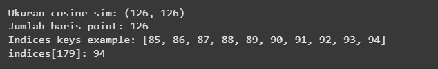<br>

#### Melihat key yang dapat diujikan
```
print(point['Place_Id'].unique())
```
#### Bentuk key data yang dapat diujikan
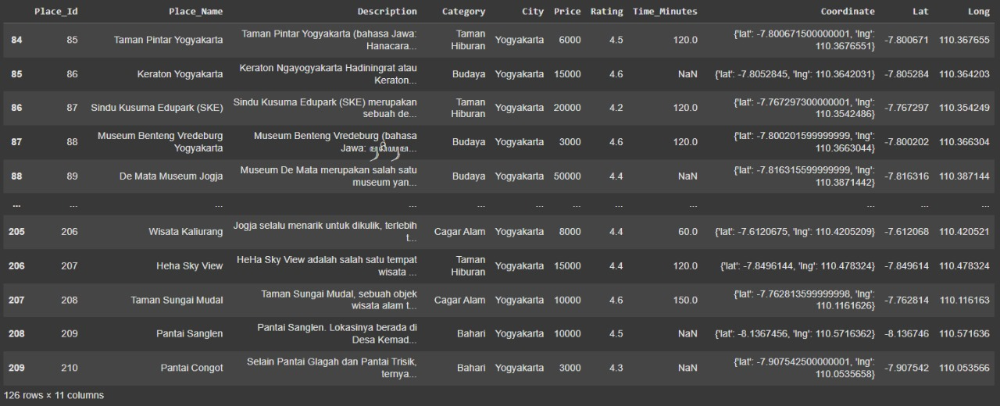<br>

#### Code Inference
##### Percobaan Inference Pertama
```
# Contoh penggunaan
place_id = 210  # Misalnya, Pantai Congot
recommendations = get_content_recommendations(place_id)
print(f"Rekomendasi untuk Place_Id={place_id} ({point[point['Place_Id'] == place_id]['Place_Name'].iloc[0]}):")
print(recommendations.to_string(index=False))
```
##### Percobaaan Inference Kedua
```
# Contoh penggunaan
place_id = 179  # Misalnya, Pantai Congot
recommendations = get_content_recommendations(place_id)
print(f"Rekomendasi untuk Place_Id={place_id} ({point[point['Place_Id'] == place_id]['Place_Name'].iloc[0]}):")
print(recommendations.to_string(index=False))
```
Penjelasan : <br>
Kode ini menunjukkan bagaimana fungsi get_content_recommendations dijalankan untuk menghasilkan rekomendasi destinasi wisata berdasarkan Content-Based Filtering. Dengan mengatur place_id = 179 atau lainnya (misalnya, Taman Sungai Mudal, bukan Pantai Congot seperti yang salah disebut di komentar), kode memanggil fungsi untuk mendapatkan 5 destinasi paling mirip berdasarkan Cosine Similarity dari vektor TF-IDF yang dibuat dari teks Description dan Category. Fungsi mengembalikan DataFrame recommendations berisi kolom Place_Id, Place_Name, Category, Rating, Price, dan Similarity_Score. Pernyataan print menampilkan nama destinasi acuan (diambil dari point menggunakan Place_Id) dan daftar rekomendasi dalam format teks rapi tanpa indeks, memungkinkan pengguna melihat destinasi serupa dengan skor kesamaan tertinggi secara langsung.

Output : <br>
- Percobaan Pertama <br>
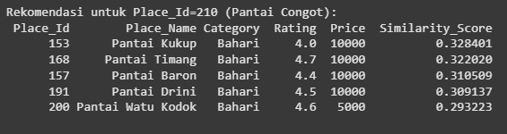<br>
- Percobaan Kedua <br>
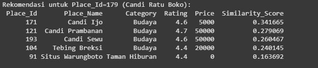<br>
Interpretasi : <br> 
sistem Content-Based Filtering menunjukkan performa yang konsisten dalam merekomendasikan destinasi wisata berdasarkan kesamaan teks Description dan Category menggunakan Cosine Similarity. Untuk Place_Id=210 (Pantai Congot) dengan kategori "Bahari", semua 5 rekomendasi (Pantai Kukup, Pantai Timang, Pantai Baron, Pantai Drini, dan Pantai Watu Kodok) berada dalam kategori yang sama dengan rating tinggi (4.0–4.7) dan skor kesamaan yang cukup tinggi (0.293223–0.328401), menunjukkan bahwa sistem efektif mengidentifikasi destinasi pantai yang relevan meskipun skor kesamaan tidak terlalu mendekati 1.0, kemungkinan karena deskripsi yang kurang spesifik. Sebaliknya, untuk Place_Id=179 (Candi Ratu Boko) dengan kategori "Budaya", 4 dari 5 rekomendasi (Candi Tjo, Candi Prambanan, Candi Sewu, dan Tebing Breksi) juga sesuai kategori dengan rating tinggi (4.4–4.7) dan skor kesamaan yang lebih bervariasi (0.163692–0.341665), namun masuknya Sitrus Warungboto (kategori Taman Hiburan, skor 0.163692) menunjukkan sedikit inkonsistensi, mungkin akibat overlap kata atau deskripsi generik, mengindikasikan bahwa akurasi sistem bergantung pada kualitas dan spesifisitas data teks. Secara keseluruhan, sistem menunjukkan potensi baik untuk kategori yang seragam, tetapi perlu perbaikan dalam membedakan konten yang lebih bervariasi.


## Evaluasi
### Collaborative Filtering
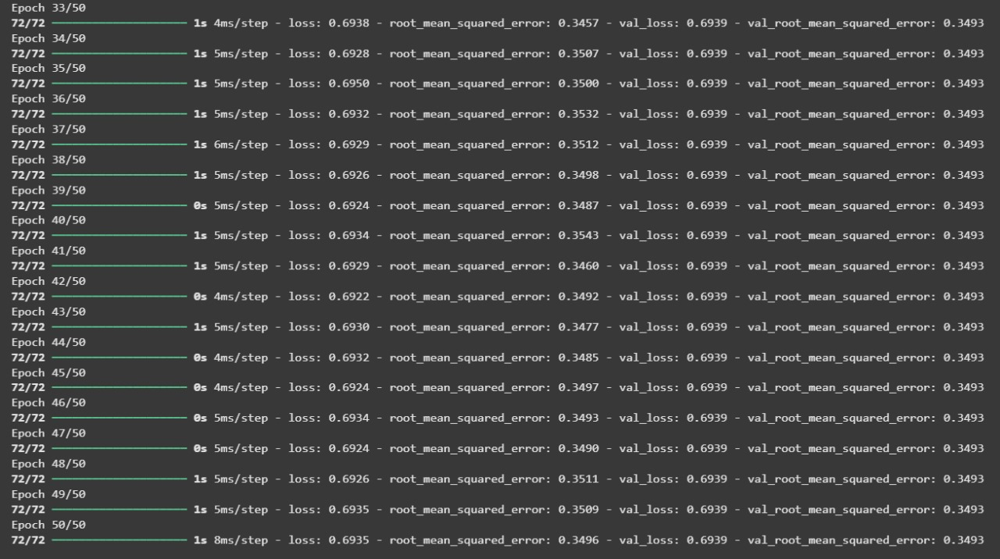<br>
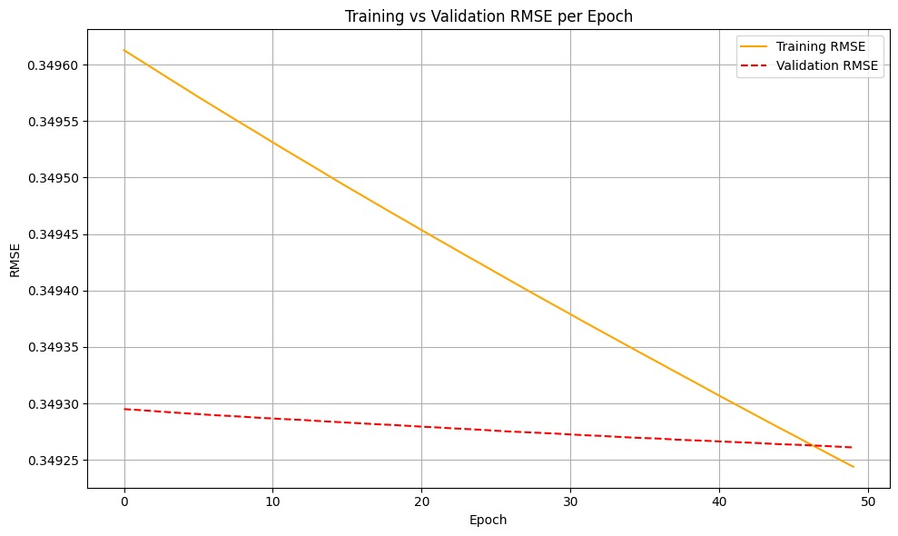<br>
Penjelasan : <br>
Berdasarkan grafik dan log pelatihan yang ditampilkan, model menunjukkan penurunan RMSE (Root Mean Squared Error) secara konsisten pada data pelatihan dari sekitar 0.3496 ke 0.3492 selama 50 epoch, sementara RMSE pada data validasi cenderung stagnan di sekitar 0.3493. Meskipun nilai RMSE pelatihan terus menurun, penurunan tersebut sangat kecil, dan tidak diikuti oleh peningkatan performa pada data validasi, yang menunjukkan bahwa model mungkin mulai mengalami overfitting ringan atau bahwa model telah mencapai batas kemampuannya dalam mempelajari pola dari data. Hal ini diperkuat oleh log epoch yang menunjukkan bahwa mulai dari epoch ke-33 hingga ke-50, nilai val_root_mean_squared_error tetap berada pada angka 0.3493 tanpa perubahan berarti, menunjukkan bahwa model tidak lagi belajar hal baru yang berdampak terhadap generalisasi.

### Content Based Filtering
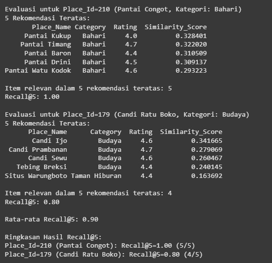<br>
Berdasarkan hasil evaluasi Content-Based Filtering pada dua destinasi, sistem menunjukkan performa yang bervariasi dalam merekomendasikan destinasi wisata menggunakan Cosine Similarity berbasis teks Description dan Category. Untuk Place_Id=210 (Pantai Congot, Bahari), semua 5 rekomendasi (Pantai Kukup, Pantai Timang, Pantai Baron, Pantai Drini, Pantai Watu Kodok) sesuai kategori dengan rating tinggi (4.0–4.7) dan skor kesamaan 0.293223–0.328401, menandakan sistem cukup efektif untuk kategori seragam seperti "Bahari", meskipun skor kesamaan yang relatif rendah mengindikasikan deskripsi teks mungkin kurang spesifik. Sementara itu, untuk Place_Id=179 (Candi Ratu Boko, Budaya), 4 rekomendasi (Candi Tjo, Candi Prambanan, Candi Sewu, Tebing Breksi) relevan dengan kategori "Budaya" dan rating 4.4–4.7, namun satu rekomendasi (Sitrus Warungboto, Taman Hiburan) dengan skor kesamaan terendah (0.163692) menunjukkan adanya ketidaktepatan, kemungkinan akibat deskripsi generik atau overlap kata, sehingga sistem perlu peningkatan pada kualitas data teks agar lebih akurat dalam merekomendasikan destinasi lintas kategori.

## Kesimpulan
Berdasarkan analisis dan pengujian, kesimpulan dari proyek ini adalah:

Proyek ini berhasil membangun sistem rekomendasi destinasi wisata di Yogyakarta menggunakan dataset dari Kaggle dengan dua pendekatan: collaborative filtering dan content-based filtering, untuk membantu wisatawan merencanakan perjalanan sesuai preferensi. Collaborative filtering mencapai RMSE stabil di 0.3493 pada data validasi, menunjukkan akurasi prediksi yang cukup baik namun dengan tanda-tanda overfitting ringan setelah epoch ke-33, serta rentan terhadap masalah cold-start pada pengguna baru. Sebaliknya, content-based filtering menunjukkan performa bervariasi: efektif untuk kategori seragam seperti "Bahari" (Pantai Congot, semua 5 rekomendasi relevan), tetapi kurang akurat untuk kategori "Budaya" (Candi Ratu Boko, 1 dari 5 rekomendasi tidak relevan) karena deskripsi teks yang generik, dengan skor kesamaan rendah (0.163692–0.341665). Untuk meningkatkan performa, disarankan memperbaiki kualitas deskripsi destinasi, menambahkan fitur seperti ulasan pengguna, dan mengadopsi pendekatan hybrid guna mengatasi keterbatasan cold-start dan inkonsistensi relevansi rekomendasi.

## Referensi
- Kaggle. (2025). Indonesia Tourism Destination Dataset. Diakses pada 29 Mei 2025 dari https://www.kaggle.com/datasets/aprabowo/indonesia-tourism-destination.
- Brownlee, J. (2020). Recommender Systems with Python. Machine Learning Mastery. Diakses pada 29 Mei 2025 dari https://machinelearningmastery.com/recommender-systems-with-python/.
- Dicoding. (2024). Machine Learning Terapan. Diakses pada 29 Mei 2025 dari https://www.dicoding.com/academies/319-machine-learning-terapan.
